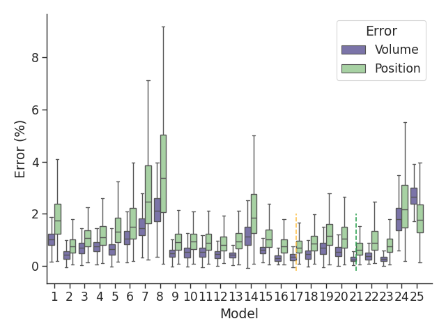
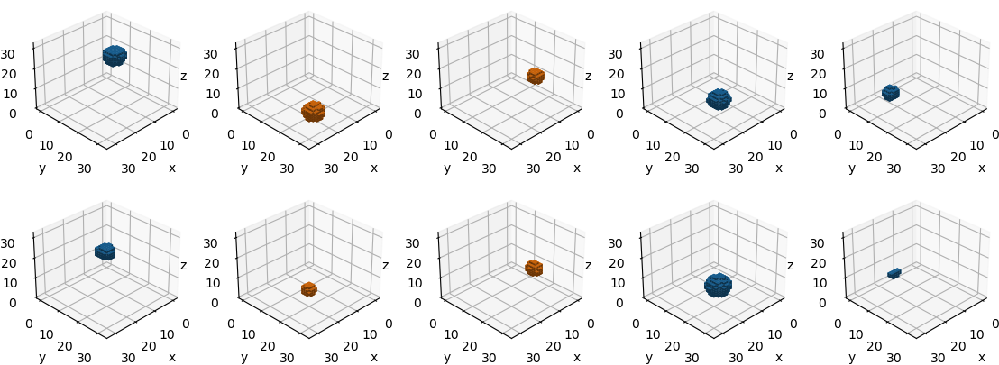

# DD3D-EIT

Repository for the Paper: https://ieeexplore.ieee.org/abstract/document/10781524

Please also cite:
    
    @INPROCEEDINGS{10781524,
      author={Thönes, Jacob and Spors, Sascha},
      booktitle={2024 46th Annual International Conference of the IEEE Engineering in Medicine and Biology Society (EMBC)}, 
      title={Data-Driven 3D Reconstruction for Electrical Impedance Tomography}, 
      year={2024},
      volume={},
      number={},
      pages={1-4},
      keywords={Electrical impedance tomography;Solid modeling;Three-dimensional displays;Inverse problems;Conductivity;Reconstruction algorithms;Market research;Robustness;Numerical models;Image reconstruction},
      doi={10.1109/EMBC53108.2024.10781524}}

Three networks are trained: a VAE $\mathbb{VAE}$, a mapper $\Xi$, and a material classifier $\Upsilon$.

The final architecture of the reconstruction network is defined by

$$
\Gamma := \Xi \circ \Psi : \mathbf{u} \mapsto \mathbf{z} \mapsto \hat{\gamma}
$$

in parallel with the material classification network

$$
\Upsilon : \mathbf{u} \mapsto m
$$

Here, $\mathbf{u}$ represents the EIT data, and $\hat{\gamma}$ is the reconstructed conductivity in a three-dimensional domain by the final reconstruction network architecture.

## Hyperparametertuning $\beta$-VAE

Finally, model iteration 21 was selected (also marked with a green dashed line).

## Hyperparametertuning Mapper $\Xi$

| **VAE** | **Iteration** | **Predictable (%)** | **Median volume error (%)** | **Median position error (%)** |
|---------|---------------|---------------------|-----------------------------|-------------------------------|
| 21      | 1             | 92.19               | 0.16                        | 4.14                          |
| 21      | 2             | 90.94               | 0.16                        | 4.31                          |
| 21      | 3             | 92.09               | 0.14                        | 4.39                          |
| 21      | 4             | 92.77               | 0.15                        | 4.12                          |
| 21      | 5             | 54.65               | -0.10                       | 8.73                          |
| 21      | 6             | 92.54               | 0.09                        | 4.72                          |
| 21      | 7             | 92.58               | 0.14                        | 4.58                          |
| **21**  | **8**         | **96.01**           | **0.13**                    | **4.55**                      |
| 21      | 9             | 90.83               | 0.12                        | 4.44                          |

## Final reconstruction network architecture results

Five randomly selected EIT measurements were taken from the test data. The test data was not used throughout the training phases.
The presented graph provides a proof of concept and shows the feasibility of reconstructing different objects within a phantom tank using a data-driven reconstruction approach.

The top row is the true conductivity distribution $\gamma$. The lower row represents the predictions of the reconstruction model $\hat{\gamma}$.

### Environment

To install the used Python (3.11.2) environment, use

    conda env create -f environment.yml
